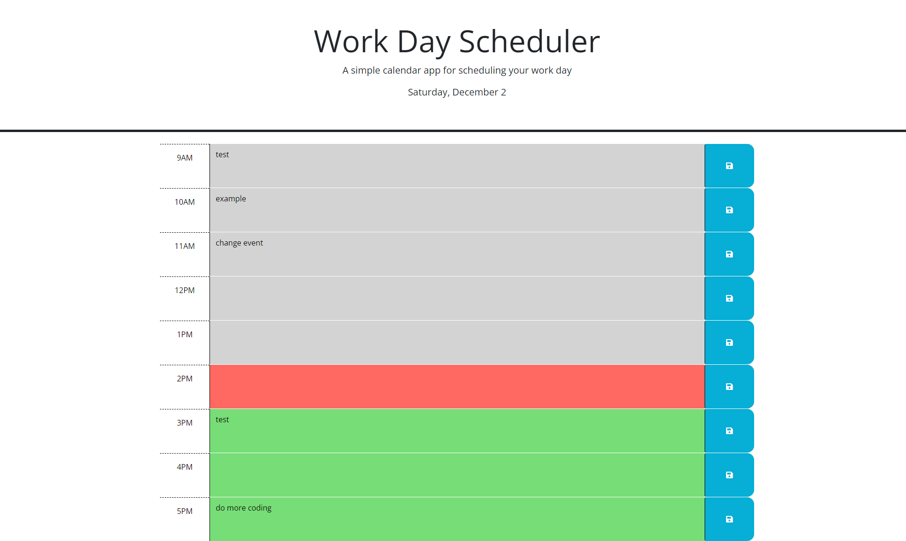

# Work Day Scheduler

## Description
Web application that displays current day, allows users to input appointments between 9am and 5pm for that day,
and color codes input time blocks on the schedule dynamically based on the current hour of the day. I utilized 
the day.js date utility library for date and time data. As a coding bootcamp student, I utilized this project to 
practice DOM navigation and manipulation, 3rd party api usage, and frameworks such as jquery and bootstrap.

## Usage
URL:  https://danidrury.github.io/work-day-scheduler/
Click time blocks to enter appointment information. Click the save icon at the end of the row to save appointment to local storage.

## Credits
APIs used:
jquery
bootstrap
day.js

## License
MIT License
